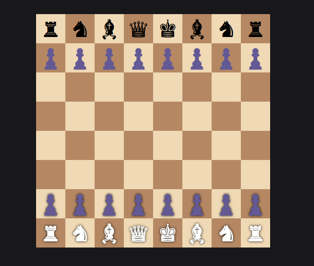

# Real-Time Chess Game 🧩

  
*Above is a screenshot of the user interface of the Chess Game.*

---

## 🌟 Overview

This is a **real-time chess game** built using `Node.js`, `EJS`, and `Socket.IO`. Two players can connect and play chess in real time.  
The game is designed to demonstrate the fundamentals of building a multiplayer game with live updates.  

### Key Features:
- **Real-time gameplay** between two players.
- Frontend built with **Vanilla HTML, CSS, and JavaScript**.
- Styling powered by **Tailwind CSS** (via CDN).
- Backend powered by **Node.js** with **Socket.IO** for real-time communication.
- Chess logic implemented using the **chess.js** library.

---

## 🛠️ Technologies Used

### Frontend:
- Vanilla HTML, CSS, JavaScript
- Tailwind CSS (via CDN)
- Socket.IO (via CDN)

### Backend:
- Node.js
- EJS (Embedded JavaScript Templates)
- Socket.IO

---

## 🚀 Getting Started

Follow these steps to set up the project locally:

### 1️⃣ Clone the Repository:
```bash
git clone git remote add origin https://github.com/cykoravish/chess_game_nodeJs_ejs.git
cd chess_game_nodeJs_ejs
npm install
npx nodemon
http://localhost:3000
```

## 📚 How It Works

- The game initializes a chess board and connects two players.
- Moves are validated using the chess.js library.
- Players see each other's moves in real time thanks to Socket.IO.
- The board updates dynamically to reflect the current state of the game.

## 📂 Project Structure
.
├── public
│   ├── css
│   │   └── styles.css   # Custom styles for the frontend
│   ├── js
│   │   └── game.js      # Main JavaScript for game logic
├── views
│   └── index.ejs        # Main EJS template
├── server.js            # Backend server setup
└── README.md            # Project documentation

## 🤝 Contributing

Feel free to contribute by submitting issues or pull requests.
Any contributions are welcome to enhance the project!

## 📜 License

This project is licensed under the MIT License.